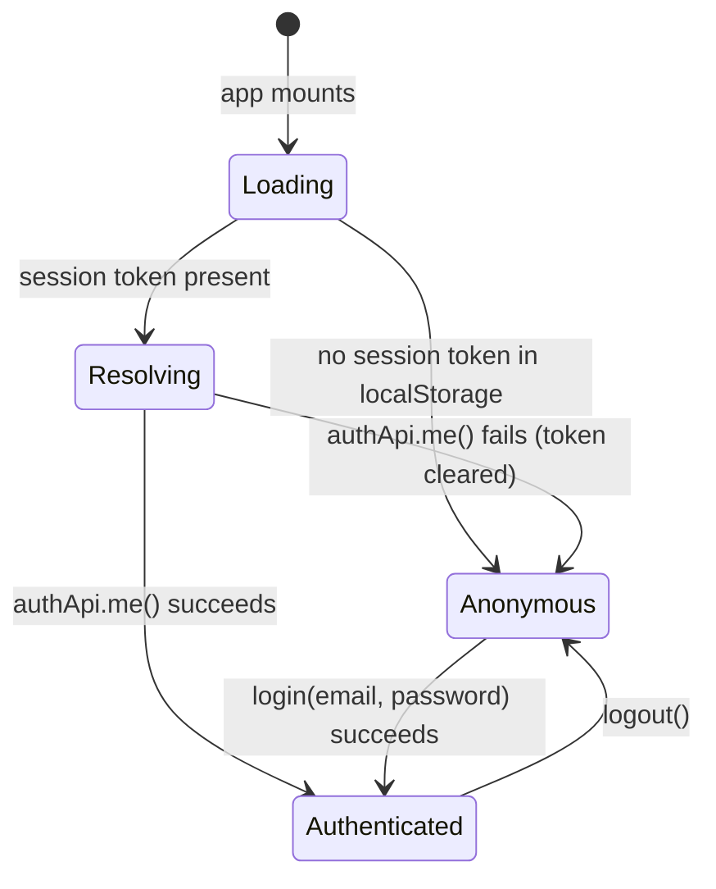

# Part 3 — Frontend

**Supersedes/synthesizes:** no single existing doc covers the frontend end-to-end; this consolidates scattered mentions across `README.md`, `ARCHITECTURE.md`, `ORGANISATION_SETTINGS.md`, `AGENT_DIRECTORY.md`, `POLICY_STUDIO*.md`, and `UX_IMPROVEMENTS.md` into one current picture, grounded directly in `src/app/routes.tsx` and the live component tree.

## 3.1 Stack and shape

React 18 + Vite 6 + react-router 7 (data router, `createBrowserRouter`), no server-side rendering — this is an authenticated operational tool, not a page that needs to be indexed. One route tree (`src/app/routes.tsx`), one persistent shell (`src/app/components/Layout.tsx`), one nav ordered to match the actual workflow.

Every real page is code-split by route (`lazy: () => import(...)`) — the initial bundle loads only the shell and whichever single page a visitor requested, not Policy Studio, both AI builders, and every Live page up front.

## 3.2 The nav, and why it's five items

`Layout.tsx`'s `navItems` (the entire primary nav):

| Nav label | Route | Icon |
|---|---|---|
| Overview | `/` | Compass |
| Agents | `/agents` | Bot |
| Governance | `/governance` | ScrollText |
| Decisions | `/decisions` | FlaskConical |
| Evidence | `/evidence` | Database |
| Assurance | `/assurance` | Building2 |
| Organisation Settings | `/organization` | Settings |

This is one workflow, in order, with no department-shaped groups and no duplicate "real" vs. "demo" sections. "Agents" and "Governance" are renames from an earlier "Authority" / "Policy Studio" naming (the UX simplification pass, see [16_CURRENT_LIMITATIONS.md](16_CURRENT_LIMITATIONS.md)) — "Authority" collided with three other unrelated uses of the same word elsewhere in the product, so it was retired as a nav label (the underlying domain concept "authority" still exists, see [08_RUNTIME_AUTHORITY.md](08_RUNTIME_AUTHORITY.md)).

## 3.3 Route map (current, from `routes.tsx`)

**Real pages** (lazy-loaded, one component each):

| Path | Page component | Purpose |
|---|---|---|
| `/` | `PlatformOverview` | Landing/overview page |
| `/agents` | `AgentDirectoryPage` | Searchable/filterable/paginated agent list (Phase 9) |
| `/agents/:agentId` | `AgentDetailPage` | Single agent: certificates, lifecycle timeline, audit events |
| `/decisions` | `LiveTestIntent` | Submit a real signed test Intent, see the live Decision |
| `/evidence` | `LiveEvidence` | Browse/verify Evidence records |
| `/assurance` | `LiveAssurance` | Live counts: agents, policies, decisions by outcome |
| `/login` | `LoginPage` | Public. Session login (Phase 10) |
| `/setup-owner` | `SetupOwnerPage` | Public. First-run bootstrap of the Owner account |
| `/organization` | `OrganizationSettingsPage` | Requires session (`RequireAuth`) |
| `/organization/users` | `UsersPage` | Requires session. User/role management |
| `/governance` | `PolicyListPage` | Entry point for all policy work — links out to every authoring mode below |
| `/governance/approvals` | `ReviewQueuePage` | Pending-review queue |
| `/governance/new` | `PolicyWorkspacePage` | Manual authoring, new policy |
| `/governance/:policyKey` | `PolicyWorkspacePage` | Manual authoring, edit existing policy |
| `/governance/:policyKey/versions` | `VersionsPage` | Version history + diff (merged page) |
| `/governance/:policyKey/publish` | `PublishPage` | Compile + dry-run + deploy (merged page) |
| `/governance/upload` | `AIPolicyBuilderUploadPage` | AI Policy Builder: single-document upload |
| `/governance/upload/:uploadId` | `AIPolicyBuilderReviewPage` | AI Policy Builder: review extracted candidates |
| `/governance/authority-builder` | `AIAuthorityBuilderUploadPage` | AI Authority Builder: multi-document corpus upload |
| `/governance/authority-builder/:corpusId` | `AIAuthorityBuilderCorpusReviewPage` | AI Authority Builder: corpus review |

**Redirect-only routes** (no component, just `<Navigate>`), preserved so no bookmark or external link 404s: `/governance/legacy-review`, `/governance/:policyKey/{diff,compile,dry-run,deploy}`, `/authority`, `/authority/*`, `/policy-studio`, `/policy-studio/review-queue`, `/policy-studio/*`, `/platform-overview`, `/command-center`, `/dashboard`, `/authority-center`, `/ai-agents-registry`, `/ai-agents`, `/decision-intercepts`, `/evidence-vault`, `/policy`, `/policy-library`, `/policy-center`, `/ai-policy-builder`, `/governance-simulation`, `/approvals`, `/assurance-center`, `/insurance-readiness`, `/settings`, `/live`, `/live/documents`, `/live/agents`, `/live/test-intent`, `/live/evidence`.

This redirect list is itself a historical record: PayReality's frontend has gone through at least three naming/IA passes (a "Live" prefix era, a "Command Center"/"Authority Center" era, and the current workflow-ordered nav), and every URL anyone might have bookmarked from any of those eras still resolves. `*` (catch-all) renders `NotFound`.

## 3.4 Directory structure (`src/app/`)

```
app/
├── agents/              Agent Directory + Detail (Phase 9), status badges, health dot, lifecycle timeline
├── ai-authority-builder/  Multi-document corpus upload + review
├── ai-policy-builder/     Single-document upload + review, candidate cards, confidence badges
├── auth/                Phase 10: AuthContext, LoginPage, SetupOwnerPage, RequireAuth, authApi
├── components/          Layout (the shell/nav), shared ui/ primitives (sheet, mobile hook), AiComingSoonBanner
├── help/                In-app contextual help: HelpButton, HelpPanel, HelpContext, searchable content.ts
├── live/                Cross-cutting: apiClient, crypto.ts (client-side Ed25519 keygen/signing), agentKeyStore,
│                        operatorKey.ts, sessionToken.ts, format.ts, plus the 3 remaining "Live*" pages
├── organization/        Organisation Settings + Users pages (Phase 10)
├── pages/               PlatformOverview, NotFound, RouteErrorBoundary
├── policy-studio/       Manual authoring: PolicyListPage, PolicyWorkspacePage, PublishPage, VersionsPage,
│                        ReviewQueuePage, condition-row/scope-field components, describePolicy.ts
├── routes.tsx           The entire route tree
└── main.tsx / App.tsx   Entry point, providers (AuthProvider wraps the router)
```

## 3.5 State management: no framework, and why that's still correct

There is no Redux/Zustand/React Query. State is:

- **Server state:** fetched directly per-page via `apiClient` inside `useEffect`/event handlers, held in local component state. No client-side cache layer.
- **Auth state:** one React Context (`AuthContext`, §3.6), holding the current `User` plus a `loading` flag that distinguishes "still checking for an existing session" from "checked, no user" (needed so `RequireAuth` doesn't flash the login page on every reload).
- **Cross-request identity:** two independent `localStorage`-backed values, not context — the operator key (`operatorKey.ts`) and the session token (`sessionToken.ts`) — read directly by `apiClient` on every request rather than threaded through props.

This is a deliberate fit for the current data volumes and single-tenant scope, not an oversight: see [20_ARCHITECTURAL_ASSESSMENT.md](20_ARCHITECTURAL_ASSESSMENT.md) for when this would need to change (multi-tab cache coherency, optimistic updates, or genuinely large list virtualization would each independently justify introducing a real data-fetching library; none of the three has arisen yet in this frontend's real usage).

## 3.6 Auth state in the frontend (`app/auth/AuthContext.tsx`)



`AuthContext` exposes `{ user, loading, login, logout, hasPermission }`. `hasPermission(permission)` checks `user.permissions.includes(permission)` — the frontend's permission list is exactly the same `Permission` enum values the backend's `domain/rbac/permissions.py` defines (see [14_SECURITY_MODEL.md](14_SECURITY_MODEL.md)), sent down by `GET /v1/auth/me`. `RequireAuth` (a route wrapper) redirects to `/login` when `loading` is false and `user` is null; it never gates on a specific permission itself — pages that need one call `hasPermission` directly and hide/disable the relevant action.

Note the layering with the operator key: `apiClient`'s `request()` attaches **both** `X-PayReality-Operator-Key` (if set in `localStorage` via `OperatorKeyField`) and `Authorization: Bearer <session token>` (if a session exists) to every request. The backend's `require_permission` dependency always checks the operator key first — so a logged-in human's session/role only actually governs access on a machine that has never had the shared operator key configured, which is the expected case for a real end user versus an internal operator.

## 3.7 The AI authoring frontends: parallel, not shared

`ai-authority-builder/` (multi-document corpus, produces authority *candidates*) and `ai-policy-builder/` (single document, produces a draft `RuntimePolicy` directly) are structurally parallel but independent React trees — each has its own `api.ts` and `types.ts`, not a shared abstraction. This mirrors the backend, where the two pipelines are similarly parallel rather than unified (see [09_AI_AUTHORITY_BUILDER.md](09_AI_AUTHORITY_BUILDER.md) and [10_AI_POLICY_BUILDER.md](10_AI_POLICY_BUILDER.md) for why they remain two flows rather than one).

## 3.8 Styling system

CSS custom properties (`--pr-*` tokens: `--pr-text-primary`, `--pr-text-muted`, `--pr-overlay-05`, `--pr-warning-amber`, etc.) rather than a component-level CSS framework theme — `app/lib/theme.ts` is the token source. Tailwind utility classes handle layout/spacing (`flex`, `px-5`, `gap-2.5`); the design tokens handle color/semantic meaning, so a palette change is a token edit, not a grep-and-replace across components. `lucide-react` supplies icons throughout (no custom icon set). `components/ui/` holds a small number of headless primitives (`sheet.tsx` for the mobile nav drawer, `use-mobile.ts` for the breakpoint hook) — this is not a full component library import (no shadcn/ui bulk-generated tree); each primitive here was added because a specific page needed it.

## 3.9 API client modules

One low-level client (`live/apiClient.ts`, §2's `request()` wrapper — attaches auth headers, throws `ApiError` with the parsed body on non-2xx, handles `204` and `FormData` bodies), and one typed `api.ts` per feature area built on top of it, never called directly by page components:

| Module | Backend surface it wraps |
|---|---|
| `agents/api.ts` | Agent Directory, lifecycle actions, certificates, audit events |
| `ai-authority-builder/api.ts` | Corpus upload/review/promote |
| `ai-policy-builder/api.ts` | Document upload/review/promote |
| `auth/authApi.ts` | Login, logout, `me`, owner setup |
| `organization/api.ts` | Organisation Settings, Users management |
| `policy-studio/api.ts` | RuntimePolicy CRUD, submit/approve/compile/deploy, versions |

This keeps each feature's request/response shapes typed and co-located with the feature, while the auth-header and error-handling logic lives in exactly one place (`apiClient`'s `request()`).

## 3.10 Contextual help system

`app/help/` is a self-contained in-app documentation layer: `content.ts` holds a searchable set of help entries, `HelpContext` exposes them, `HelpButton`/`HelpPanel`/`HelpIcon` render a slide-over panel and inline "?" affordances, `NextStepGuidance` surfaces a page-specific "what to do next" hint, and `search.ts` provides simple client-side full-text matching over the content. This exists so operational guidance lives next to the UI it explains rather than only in this specification or the repo's markdown files — see [21_FOUNDER_LEARNING_GUIDE.md](21_FOUNDER_LEARNING_GUIDE.md) for how the two are meant to complement each other.

## 3.11 What's active vs. dormant in the frontend

| Area | Status |
|---|---|
| Agents, Governance (all three authoring modes), Decisions, Evidence, Assurance, Organisation Settings, Users, Login | **Active** — real pages, real API calls, no mocked data |
| `LiveDocuments.tsx` (legacy document review page) | **Deleted** this cycle — see [17_LEGACY_COMPONENTS.md](17_LEGACY_COMPONENTS.md) |
| `AiComingSoonBanner` | **Partial** — a banner component for AI-feature areas still gated behind unconfigured/fake providers on the hosted demo (see [16_CURRENT_LIMITATIONS.md](16_CURRENT_LIMITATIONS.md)) |
| Redirect-only routes (§3.3) | **Dead weight kept intentionally** — zero UI, pure link-compatibility |
