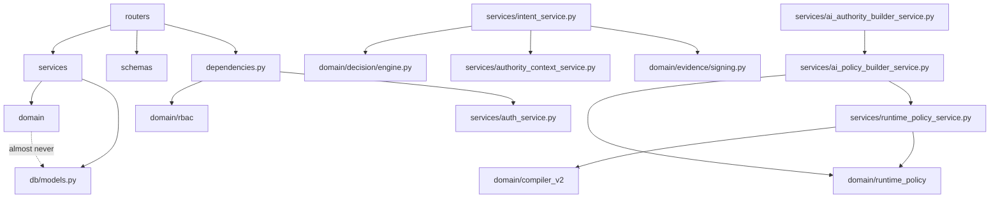
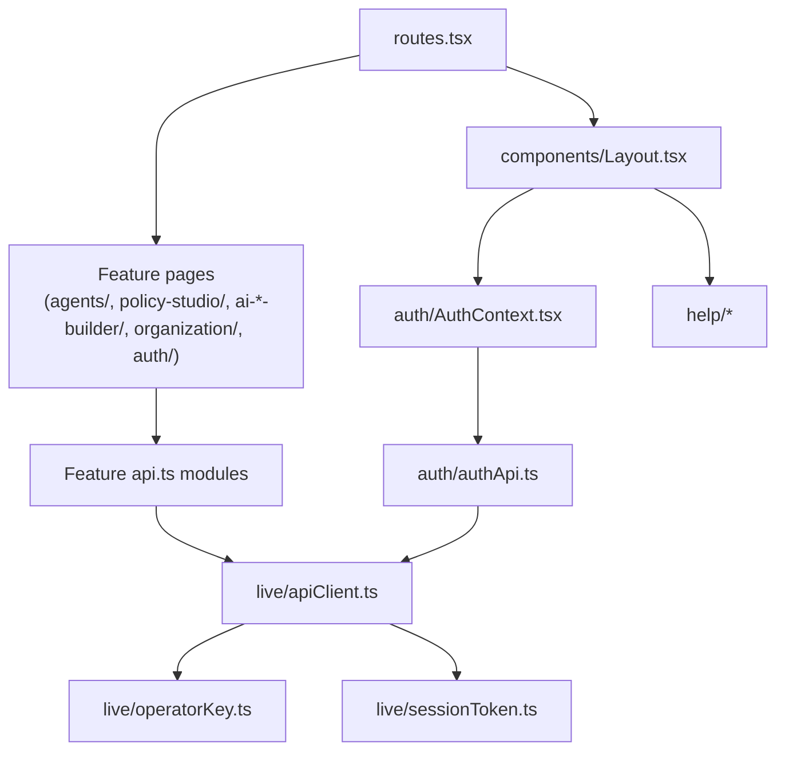

# Part 18 — Complete Dependency Graph

**Supersedes/synthesizes:** no prior document maps this end-to-end. Grounded directly in `server/pyproject.toml`, `package.json`, and the actual import graph read across this specification's research.

## 18.1 Backend third-party dependencies (`server/pyproject.toml`)

| Package | Used for |
|---|---|
| `fastapi` | Web framework |
| `uvicorn[standard]` | ASGI server |
| `sqlalchemy>=2.0` | ORM |
| `alembic` | Migrations |
| `psycopg[binary]>=3.2` | Postgres driver |
| `pydantic` / `pydantic-settings` | Schemas, env-driven config |
| `httpx` | HTTP client (OPA queries) |
| `pynacl` | Ed25519 signing/verification (Evidence, audit events, Agent certificates) |
| `anthropic` | Real AI extraction provider (AI Authority Builder, AI Policy Builder, legacy extraction) |
| `pypdf`, `python-docx`, `openpyxl` | Document text extraction (pdf/docx/xlsx) |
| `python-multipart` | File upload parsing |
| `bcrypt` | Password hashing (RBAC) |
| `pytest`, `pytest-asyncio` (dev only) | Test suite |

Notably **absent**: no task queue (Celery/RQ), no cache (Redis), no ORM-agnostic repository layer, no dependency-injection framework beyond FastAPI's own `Depends`. This is a small, deliberately shallow dependency set for the actual request volume this platform serves today — see [20_ARCHITECTURAL_ASSESSMENT.md](20_ARCHITECTURAL_ASSESSMENT.md) for when that would need to change.

## 18.2 Frontend third-party dependencies (`package.json`)

| Package | Used for |
|---|---|
| `react` / `react-dom` (peer) | UI framework |
| `react-router` 7 | Routing (data router) |
| `@noble/ed25519`, `@noble/hashes` | **Client-side** Ed25519 keypair generation and Intent signing (`live/crypto.ts`) — the private key is generated and used entirely in the browser/SDK process, never transmitted |
| `@radix-ui/react-dialog` | Headless dialog primitive (backs `components/ui/sheet.tsx`, the mobile nav drawer) |
| `clsx`, `tailwind-merge` | Conditional/merged class-name utilities |
| `lucide-react` | Icon set, used throughout |
| `tailwindcss` 4, `@tailwindcss/vite`, `tw-animate-css` | Styling |
| `vite` 6, `@vitejs/plugin-react` | Build tooling |

Notably **absent**: no state-management library (Redux/Zustand/Jotai), no data-fetching library (React Query/SWR), no full component-library bulk import (no shadcn/ui generated tree) — see [03_FRONTEND.md](03_FRONTEND.md) §3.5 for why, and [20_ARCHITECTURAL_ASSESSMENT.md](20_ARCHITECTURAL_ASSESSMENT.md) for when each would earn its way in.

## 18.3 Backend module dependency direction

**One-directional, top to bottom, no cycles.** `domain/` almost never imports from `db/models.py` — the one deliberate exception pattern is that domain modules take plain values/dataclasses and services translate to/from ORM models at the boundary. This is what keeps `domain/decision/engine.py`, `domain/compiler_v2/`, and `domain/evidence/signing.py` unit-testable without a database at all (confirmed: no DB-backed test fixtures exist anywhere in this repository — every DB-dependent code path is instead verified live against production, per this session's own established practice).

## 18.4 The one deliberate cross-service dependency worth naming

`ai_authority_builder_service.py` imports `candidate_to_content` from `ai_policy_builder_service.py` **directly** — the only inter-service import of its kind in the codebase, called out in the former's own module docstring: "reuses `services/ai_policy_builder_service.py`'s `promote_candidate`, `dismiss_candidate`, `edit_candidate`, and `get_candidate` completely unmodified... never duplicates that logic, only stores corpus-derived candidates in the same table those functions already operate on." This is a considered reuse decision (§9.4), not an accidental coupling — it means any future improvement to candidate promotion logic applies to both AI builders with one change, at the cost of the two services not being fully independent.

## 18.5 Frontend module dependency direction

Every feature area's `api.ts` depends on the one shared `apiClient`; nothing depends the other direction. `AuthContext` is the only cross-cutting React Context in the app (§3.5) — everything else is local component state or `localStorage`-backed values read directly.

## 18.6 External runtime dependencies

| Dependency | Required for | Failure mode if unavailable |
|---|---|---|
| PostgreSQL | Everything — the system of record | Total outage |
| Open Policy Agent | Every Intent evaluation | Every Intent resolves to `HUMAN_REVIEW`/`opa_error` or `opa_timeout` — fail-closed, not a crash |
| Anthropic API | Real AI extraction (both AI builders) | Falls back to deterministic fake providers automatically — a degraded but functioning mode, not an outage |
| Render (hosting) | Frontend and backend availability | Standard hosting-provider dependency |

## 18.7 What this graph implies for a rebuild

The absence of cycles and the strict `routers → services → domain` direction (§18.3) is the single most reusable architectural fact in this specification for [22_BUILD_FROM_SCRATCH.md](22_BUILD_FROM_SCRATCH.md): a rebuild that preserves this layering — pure domain logic with no DB import, services as the only place a transaction happens, routers as thin HTTP adapters — reproduces most of this platform's actual testability and reasoning-about-it property, independent of which specific framework or language it's rebuilt in.
