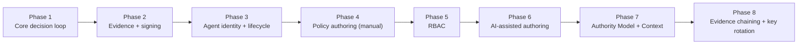

# Part 22 — Build PayReality From Scratch

**Supersedes/synthesizes:** nothing prior attempts this — it is the specification's own synthesis of everything in Parts 1–21 into a sequenced build plan, written as if commissioning a rebuild rather than describing the existing one.

## 22.1 The one paragraph to internalize before writing any code

Everything else in this platform is downstream of one property: **a Decision must be reproducible by hand from the policy and the request, and its record must be independently verifiable without trusting the server that produced it.** Every phase below exists to either produce that Decision correctly or to make its record trustworthy. If a proposed feature doesn't serve one of those two goals, it's not core — it can wait.

## 22.2 Build order, and why this order

This mirrors the actual dependency order this platform's own history followed, not an idealized one: you cannot meaningfully test policy authoring before agents exist to submit Intents against it; you cannot meaningfully add RBAC before there's more than one kind of mutating action to gate; AI-assisted authoring only earns its complexity once manual authoring has proven what a "policy" needs to contain.

## 22.3 Phase 1 — Core decision loop (weeks 1–2)

**Build:** a pure `evaluate(intent, context, policy_store, opa_client) -> Decision` function with exactly one path to `ALLOW` ([12_DECISION_ENGINE.md](12_DECISION_ENGINE.md) §12.1) — no DB, no HTTP, unit-testable against fakes from day one. Stand up OPA as a separate process; write the smallest possible Rego bundle by hand to prove the wiring. A minimal `intents`/`decisions` schema, one `Policy` row, one hardcoded bundle.

**Preserve exactly:** the fail-closed control-flow discipline — every exception type and every ambiguous result must resolve to `HUMAN_REVIEW`, enforced by the function having no other return path, not by a linter rule or a code review checklist.

**Skip for now:** agent identity (use a hardcoded principal id), evidence signing (log the decision plaintext), any authoring UI (hand-write the one test bundle).

## 22.4 Phase 2 — Evidence and signing (week 3)

**Build:** `canonicalize` (sorted-key, no-whitespace JSON) → `sign_payload`/`verify_payload` (Ed25519) → a published verification-key endpoint ([13_EVIDENCE_ENGINE.md](13_EVIDENCE_ENGINE.md) §13.1). Get this right before building anything else that depends on it — retrofitting canonical serialization onto an already-signed corpus of records is far more expensive than starting with it.

**Preserve exactly:** never store a private key server-side for anything that isn't the platform's own Evidence-signing key; verification must never raise, only return `False`.

**Decide deliberately, don't default:** whether to build the signing-key rotation registry ([13_EVIDENCE_ENGINE.md](13_EVIDENCE_ENGINE.md) §13.2) now or later. This platform built it later, and paid for it: every record signed before the registry existed had to be reconciled against it after the fact. Building it in Phase 2 from the start is cheaper than this platform's own history, if you have the foresight to see it coming.

## 22.5 Phase 3 — Agent identity and lifecycle (week 4)

**Build:** the full state machine (`registered → active ⇄ suspended`, terminal `revoked`/`retired`, [11_AGENT_ARCHITECTURE.md](11_AGENT_ARCHITECTURE.md) §11.2) from day one, not a flat "active" boolean retrofitted later — this platform's own history shows the retrofit cost (Phase 9 had to add `registered`/`retired` as new statuses onto an existing `active`-only column). Ed25519 request signing over the raw body, replay protection via a DB-level `UNIQUE(agent_id, nonce)` constraint rather than a cache.

**Preserve exactly:** the private key is generated client-side and never transmitted, ever, including during testing.

## 22.6 Phase 4 — Manual policy authoring (weeks 5–7)

**Build:** a `RuntimePolicy` value object (scope, flat AND-only conditions, effect) that is immutable — editing produces a new version, never a mutation ([07_RUNTIME_POLICY_ENGINE.md](07_RUNTIME_POLICY_ENGINE.md) §7.2). A compiler translating it to real Rego per condition, verified against a real OPA instance before trusting the generator's own claims about Rego syntax ([07_RUNTIME_POLICY_ENGINE.md](07_RUNTIME_POLICY_ENGINE.md) §7.5's docstring: "every Rego construct this module emits was verified directly against a real OPA binary before being relied on"). Conflict detection between policies sharing a scope, before deploy, not after.

**The one integration decision that matters most here:** decide up front whether "the active bundle" lives in the same table your original core-loop `PolicyStore` reads, or a new one — and if a new one, update the `PolicyStore` implementation immediately, in this phase, rather than building a compatibility bridge later. This platform's own `policies`-table situation ([17_LEGACY_COMPONENTS.md](17_LEGACY_COMPONENTS.md) §17.4) is a well-reasoned bridge, but it exists only because this decision wasn't made at this stage originally — making it now, deliberately, costs nothing; discovering the need for it later costs a whole subsystem's worth of careful compatibility work.

## 22.7 Phase 5 — RBAC (week 8)

**Build:** a fixed `Role` enum, a fixed `Permission` enum, and a `has_permission(role, permission)` function — nothing checks role identity directly, ever, anywhere ([14_SECURITY_MODEL.md](14_SECURITY_MODEL.md) §14.2). Sessions as a bearer-token-is-the-row-id design (instant revocation, no JWT) if your priority is operational simplicity over long-lived stateless tokens.

**Preserve exactly:** whatever pre-RBAC auth mechanism already gates mutations (this platform's operator key) must remain a working bypass — a security upgrade that breaks every existing integration on ship day is not a successful rollout.

## 22.8 Phase 6 — AI-assisted authoring (weeks 9–11)

**Build:** a vendor-neutral extraction provider protocol with a real backend and a deterministic fake fallback ([09_AI_AUTHORITY_BUILDER.md](09_AI_AUTHORITY_BUILDER.md) §9.6, [10_AI_POLICY_BUILDER.md](10_AI_POLICY_BUILDER.md) §10.7) — this buys you a fully functional demo/dev environment with zero API cost or key management, from day one. Structure every extraction result with the model's own uncalibrated confidence and a source citation, always shown, never filtered.

**Preserve exactly, structurally, not just by policy:** the AI-authoring code should have **no import path** to the deploy function or the OPA client ([10_AI_POLICY_BUILDER.md](10_AI_POLICY_BUILDER.md) §10.4) — make "the AI never deploys" true because the module literally cannot reach the thing that would let it, not because a code reviewer remembers to check.

## 22.9 Phase 7 — Authority Model and Runtime Authority Context (weeks 12–13)

**Build:** an optional-at-every-level org hierarchy (never force a customer with a flat structure into a mandatory multi-level one, [08_RUNTIME_AUTHORITY.md](08_RUNTIME_AUTHORITY.md) §8.2), and an ephemeral, request-scoped context enrichment merged into the OPA input as a sibling of the core request, never persisted, never a pre-filter on which policies get evaluated ([08_RUNTIME_AUTHORITY.md](08_RUNTIME_AUTHORITY.md) §8.4).

**The one bug worth designing around from the start:** if any part of your context enrichment lives at a different nesting level in the real evaluator input than your condition-authoring UI assumes, you will silently generate conditions that compile cleanly and never match, with zero errors anywhere in the pipeline ([16_CURRENT_LIMITATIONS.md](16_CURRENT_LIMITATIONS.md) §16.3). Write an end-to-end test — a real signed request through the real evaluator — for at least one condition on every distinct part of your input document's shape, before trusting any condition-authoring surface that touches it.

## 22.10 Phase 8 — Evidence chaining and key rotation, if not already built in Phase 2

**Build:** a per-tenant (or per-scope) chain, linking each record to a hash of its predecessor, verified by walking the chain and checking both signature validity and link continuity separately ([13_EVIDENCE_ENGINE.md](13_EVIDENCE_ENGINE.md) §13.3–13.4) — these catch different failure modes (tampering vs. deletion) and both need their own check.

## 22.11 What to get right immediately that this platform's own history had to retrofit

| Retrofit this platform actually had to do | Build it right the first time by |
|---|---|
| Agent lifecycle states added onto an `active`-only column | Designing the full state machine before the first Agent row is ever written |
| Signing-key rotation registry added after records already existed under one key | Building the registry in the same phase as signing itself |
| Evidence chaining added after Evidence already existed unchained | Deciding chaining scope and linking strategy before the first Evidence row |
| `TIMESTAMPTZ` retrofitted onto every datetime column after a real timezone bug | Forcing timezone-aware timestamps at the ORM base-class level from the first migration |
| Compiler V2 needing a compatibility bridge to the original Decision Engine's `PolicyStore` | Deciding the active-bundle storage location once, before a second authoring generation is ever built |

## 22.12 What not to build until forced to

Per [20_ARCHITECTURAL_ASSESSMENT.md](20_ARCHITECTURAL_ASSESSMENT.md) §20.3: no task queue, no cache layer, no repository-pattern ORM abstraction, no dependency-injection framework, no multi-tenant isolation, no distributed rate limiting. Every one of these is cheap to add later and expensive to maintain speculatively now; this platform's own restraint here is one of its better architectural decisions, not an oversight to correct in a rebuild.
